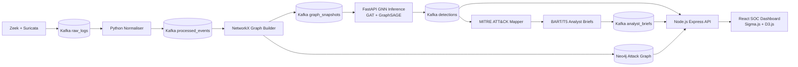

# SentinelMesh

**Network Threat Intelligence Platform with Federated Anomaly Detection**

[](https://github.com/Anishreddy-gith/sentinelmesh/actions)
[](LICENSE)
[](https://python.org)
[](https://nodejs.org)
[](infra/docker-compose.yml)

SentinelMesh detects APT lateral movement by turning network telemetry into host communication graphs, scoring those graphs with graph neural networks, enriching detections with MITRE ATT&CK context, and presenting analysts with real-time investigation views.

## Architecture



For deeper diagrams and service responsibilities, see [docs/architecture.md](docs/architecture.md).

## Key Features

- **GNN anomaly detection:** Graph Attention Network primary model and GraphSAGE baseline using PyTorch Geometric.
- **Graph-based lateral movement analysis:** NetworkX graph windows persisted to Neo4j, with Cypher queries for new edges and attack paths.
- **Federated learning:** Flower server/client scaffold for FedAvg, FedProx, and future Krum aggregation.
- **Differential privacy:** Opacus DP-SGD with Renyi DP accounting and configurable epsilon budgets.
- **Analyst brief generation:** FastAPI service for BART/T5-style summarization with template fallback.
- **MITRE ATT&CK enrichment:** Technique mapping and dashboard heatmap groundwork.
- **SOC dashboard:** React 18, Vite, Tailwind CSS, Sigma.js graph visualization, D3.js heatmaps, TanStack Query, and Axios.
- **Secure backend foundation:** Express API with JWT, express-jwt middleware, Casbin RBAC hook, Helmet, CORS, rate limiting, Redis, MongoDB, Neo4j, KafkaJS, and WebSocket dependencies.
- **Local infra:** Docker Compose stack for Kafka, Zookeeper, MongoDB, Neo4j, Redis, backend, frontend, ingestion, graph, ML inference, and FL server.
- **CI and security scanning:** GitHub Actions for frontend linting, backend tests, Python tests, Snyk, and Trivy.

## Technology Stack

| Area | Technologies |
|------|--------------|
| Frontend | React 18, Vite 5, React Router, Tailwind CSS, TanStack Query, Axios, Sigma.js, Graphology, D3.js, Vitest, ESLint |
| Backend API | Node.js 20, Express 4, JSON Web Tokens, express-jwt, Casbin, bcryptjs, Mongoose, Neo4j Driver, KafkaJS, Redis, ws, Helmet, CORS, express-rate-limit, Jest, Supertest |
| Ingestion | Python 3.11, kafka-python, python-dotenv, Zeek `conn.log`, Suricata `eve.json`, pytest |
| Graph Service | Python 3.11, NetworkX, Neo4j Python Driver, Cypher, Kafka, pytest |
| ML and AI | PyTorch 2.3, PyTorch Geometric, GATConv, SAGEConv, scikit-learn, FastAPI, Uvicorn, HuggingFace Transformers, Datasets, Flower, Opacus, rouge-score |
| Datastores | Neo4j 5, MongoDB 7, Redis 7 |
| Streaming | Apache Kafka, Confluent Zookeeper |
| Infrastructure | Docker, Docker Compose, pnpm workspaces, GitHub Actions |
| Security | JWT access tokens, RBAC design with Casbin, rate limiting, Helmet, hash-chained audit log schema, Snyk, Trivy |
| Research Targets | UNSW-NB15, CIC-IDS2018, LANL Unified Host and Network Dataset, federated GNN detection, differential privacy, adversarial robustness |

## Repository Layout

```text
backend/     Node.js API, auth middleware, routes, Mongo schemas, Kafka and Neo4j service adapters
frontend/    React SOC dashboard, pages, hooks, API client, visualization component stubs
ingestion/   Zeek and Suricata Kafka producers, normalizer consumer, parser tests
graph/       NetworkX graph builder, Neo4j writer, Cypher detection queries, tests
ml/          GNN models, inference service, federated learning, privacy accounting, NLP briefs, MITRE mapper
infra/       Docker Compose stack, Kafka topic script, Neo4j init Cypher
docs/        Architecture, API reference, Kafka topic reference
research/    Threat model and draft paper
```

## Service Ports

| Service | Port |
|---------|------|
| Frontend | 3000 |
| Backend API | 3001 |
| GNN Inference | 8000 |
| Brief Generation | 8001 |
| FL Server | 8080 |
| Kafka | 9092 |
| Zookeeper | 2181 |
| Neo4j Browser | 7474 |
| Neo4j Bolt | 7687 |
| MongoDB | 27017 |
| Redis | 6379 |

## Quick Start

```bash
git clone https://github.com/Anishreddy-gith/sentinelmesh.git
cd sentinelmesh
cp .env.example .env
# Edit .env and set JWT_SECRET plus any local passwords.
cd infra
docker compose up -d
bash kafka/topics.sh
```

Frontend: http://localhost:3000

Backend API: http://localhost:3001/health

GNN Inference: http://localhost:8000/health

Brief Generation: http://localhost:8001/health

Neo4j Browser: http://localhost:7474

## Development Phases

| Phase | Weeks | Goal | Key Deliverable |
|-------|-------|------|-----------------|
| 1 | 1-4 | Dev environment and infra setup | Kafka, Neo4j, MongoDB running in Docker |
| 2 | 5-7 | Zeek/Suricata ingestion pipeline | 10,000 events flowing end-to-end |
| 3 | 7-10 | Graph construction and Neo4j integration | 15-minute snapshots in Neo4j |
| 4 | 9-14 | GNN training and inference service | GAT AUC > 0.85, GNNExplainer working |
| 5 | 13-16 | MITRE mapping and dashboard alert feed | Every detection enriched with ATT&CK ID |
| 6 | 15-20 | Federated learning with DP-SGD | 3-client FL simulation, epsilon tracked |
| 7 | 18-22 | Analyst brief generation | Brief generated per detection in under 2 seconds |
| 8 | 20-24 | Dashboard polish, Kubernetes, security hardening | Full demo, CI green, ZAP scan clean |

## Research Extensions

- Temporal GNN for persistent threat detection.
- Adversarial robustness of GAT against graph perturbation.
- GNNExplainer user study with SOC analysts.
- Cross-domain federated learning across organization profiles.
- LLM-based incident reasoning with Llama and Mistral families.

## Team

| Frontend and Visualization | React dashboard, Sigma.js graph, ATT&CK heatmap |
| Backend and Ingestion | Node.js API, Kafka pipeline, MongoDB, Neo4j, auth |
| ML and Research | GNN, federated learning, analyst briefs, MITRE classifier |

## License

MIT
