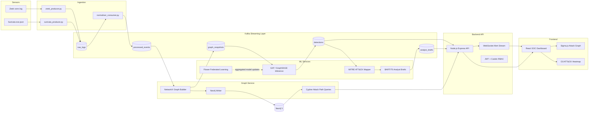
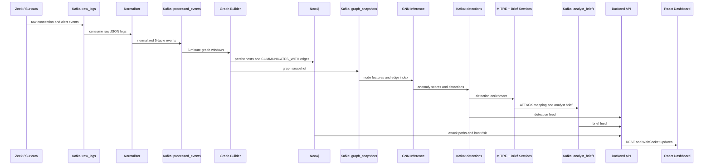
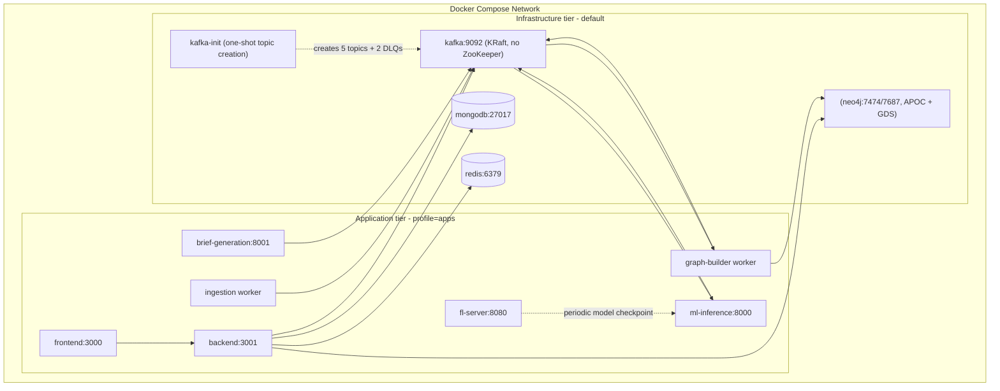

# SentinelMesh - Architecture

SentinelMesh is a multi-service threat intelligence platform for detecting lateral movement in enterprise networks. It combines Zeek and Suricata telemetry, Kafka streaming, graph construction, Neo4j attack-path analysis, GNN anomaly detection, federated learning, MITRE ATT&CK enrichment, and analyst-facing brief generation.

## Two planes (this distinction is load-bearing)

SentinelMesh has two independent control loops that share a model artifact but never share a Kafka topic:

1. **Real-time inference plane (online).** A linear, five-stage Kafka pipeline: `raw_logs → processed_events → graph_snapshots → detections → analyst_briefs`. Every detection traverses these topics in order, MITRE ATT&CK mapping is performed between `detections` and `analyst_briefs`, and the backend API consumes from `detections` and `analyst_briefs` for the dashboard.
2. **Offline training plane (asynchronous).** Flower-based federated learning across multiple organizations, with Opacus DP-SGD per client and aggregation strategies (FedAvg / FedProx / Krum). This loop runs on its own cadence and produces a periodically updated GNN checkpoint that the inference service loads. **FL/DP is not inline between detection stages**; do not redraw the diagram that way.

The "AI Response / Recommendation engine" (containment + mitigation suggestions) is a **deferred stretch feature** because it requires an asset-inventory dependency that does not yet exist. It is not on the Phase 2.0 / Phase 2 critical path.

## System Overview

## Data Flow

## Service Responsibilities

| Service | Responsibility | Key Technologies |
|---------|----------------|------------------|
| `frontend` | SOC dashboard, investigations, graph visualization, ATT&CK heatmap | React 18, Vite, Tailwind CSS, TanStack Query, Sigma.js, Graphology, D3.js, Axios |
| `backend` | REST API, auth, RBAC hooks, alert/detection/brief routes, Neo4j and Kafka service adapters | Node.js 20, Express, JWT, express-jwt, Casbin, Mongoose, Neo4j Driver, KafkaJS, Redis, WebSocket, Helmet, CORS |
| `ingestion` | Zeek and Suricata producers plus raw log normalization | Python 3.11, kafka-python, python-dotenv, pytest |
| `graph` | Time-windowed host graph construction and Neo4j persistence | Python 3.11, NetworkX, Neo4j Python Driver, Kafka, Cypher |
| `ml` | GNN inference, GraphSAGE baseline, GAT model, federated learning, privacy accounting, brief generation, MITRE mapping | PyTorch, PyTorch Geometric, FastAPI, Uvicorn, Flower, Opacus, Transformers, Datasets, scikit-learn |
| `infra` | Local development stack and bootstrap scripts | Docker Compose, Kafka, Zookeeper, MongoDB, Neo4j, Redis |
| `.github` | CI and security scanning | GitHub Actions, pnpm, pytest, Snyk, Trivy |

## Runtime Topology

Docker Compose splits services into two tiers via the `apps` profile:

- **Infrastructure tier (no profile, default `docker compose up -d`):** Kafka, kafka-init, Neo4j, Mongo, Redis. This is the only tier expected to come up cleanly during Phase 2.0.
- **Application tier (`--profile apps`):** backend, frontend, ingestion, graph-builder, ml-inference, fl-server. These are scaffold-stage and are not built by default; each is enabled as its phase PR completes.

## Kafka Topics

All Kafka messages use the frozen `{header, payload}` envelope at `schema_version = 1.0.0`. See [`kafka_topics.md`](kafka_topics.md) and [`SCHEMA.md`](SCHEMA.md) for the authoritative spec.

| Topic | Partitions | Retention | Producer | Consumer | Purpose |
|-------|------------|-----------|----------|----------|---------|
| `raw_logs` | 6 | 24 h | Zeek and Suricata producers | Normaliser | Raw sensor telemetry |
| `processed_events` | 6 | 48 h | Normaliser | Graph Builder | Normalised 5-tuple events |
| `graph_snapshots` | 3 | 24 h | Graph Builder | GNN inference | Windowed host communication graph |
| `detections` | 3 | 7 d | ML inference | Backend, MITRE mapper, brief service | Anomaly detection results |
| `analyst_briefs` | 3 | 7 d | Brief service | Backend | Plain-English analyst summaries |
| `raw_logs.dlq`, `processed_events.dlq` | 3 | 7 d | upstream producer/consumer | operator triage | Schema-validation / parse failures |

## Datasets

| Dataset | Role | Notes |
|---------|------|-------|
| **DARPA OpTC** | **Primary** | Real, labeled APT kill-chains, graph-native. Trains the GAT. |
| UNSW-NB15 | Warm-up / baseline | Used to validate the training pipeline before OpTC. |
| LANL Unified Host/Network | **Not used for GAT training** | Unlabeled; cannot supervise the model. May be used for unsupervised drift studies in research. |

## Service Ports

| Service            | Port       | Technology                          |
|--------------------|------------|-------------------------------------|
| Frontend           | 3000       | React 18 + Vite                     |
| Backend API        | 3001       | Node.js + Express                   |
| GNN Inference      | 8000       | FastAPI + PyTorch                   |
| Brief Generation   | 8001       | FastAPI + HuggingFace               |
| FL Server          | 8080       | Flower (gRPC)                       |
| Kafka              | 9092       | Apache Kafka (KRaft, no ZooKeeper)  |
| Neo4j Browser      | 7474       | Neo4j 5 (APOC + GDS)                |
| Neo4j Bolt         | 7687       | Neo4j 5 (APOC + GDS)                |
| MongoDB            | 27017      | MongoDB 7                           |
| Redis              | 6379       | Redis 7                             |
